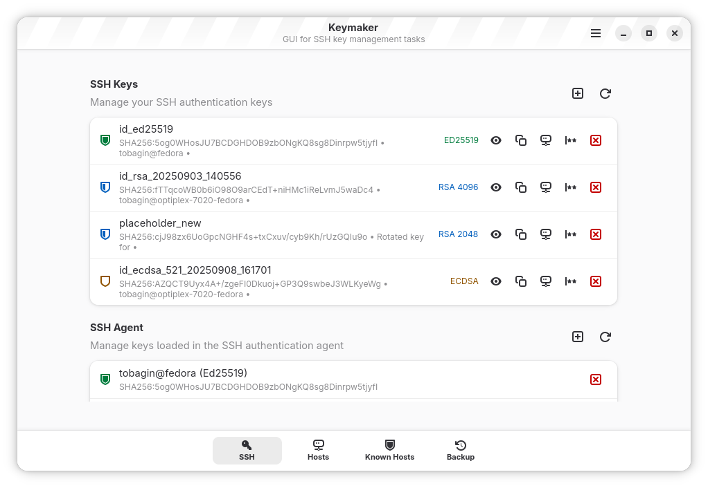
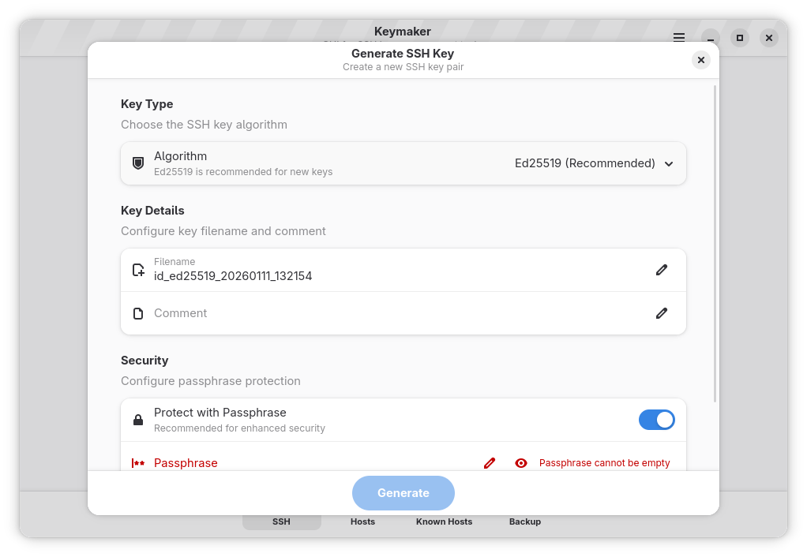
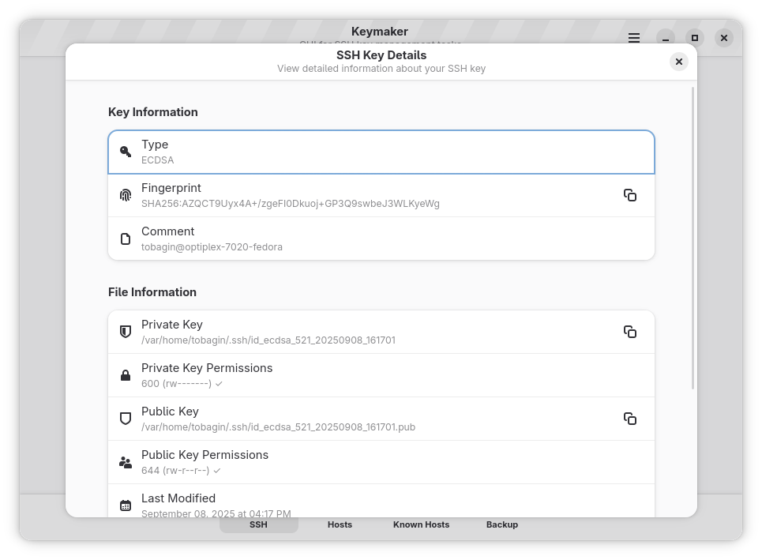
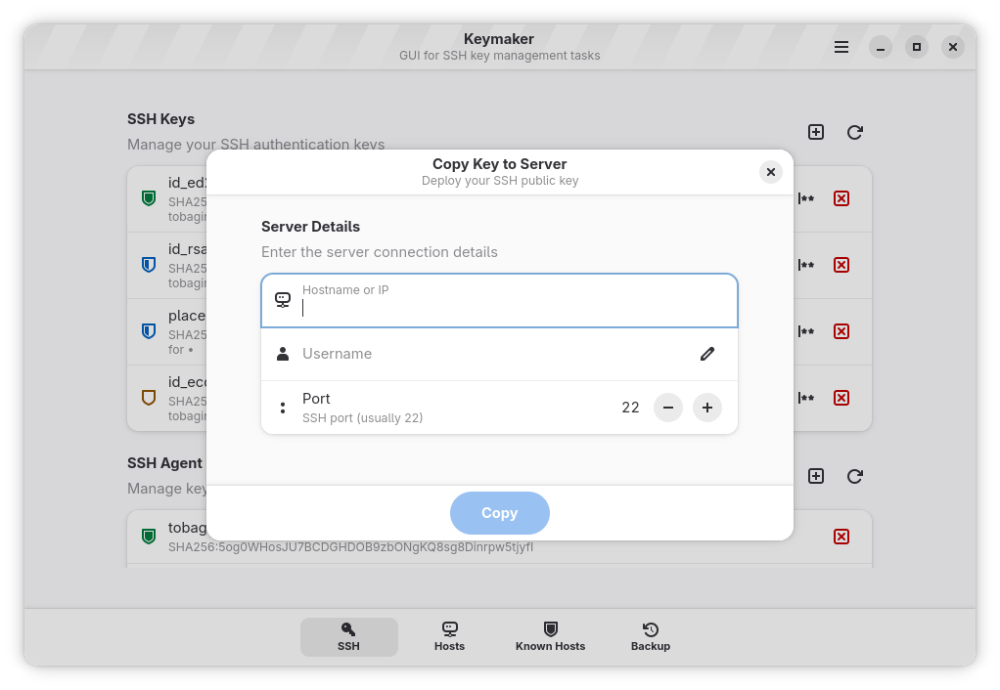
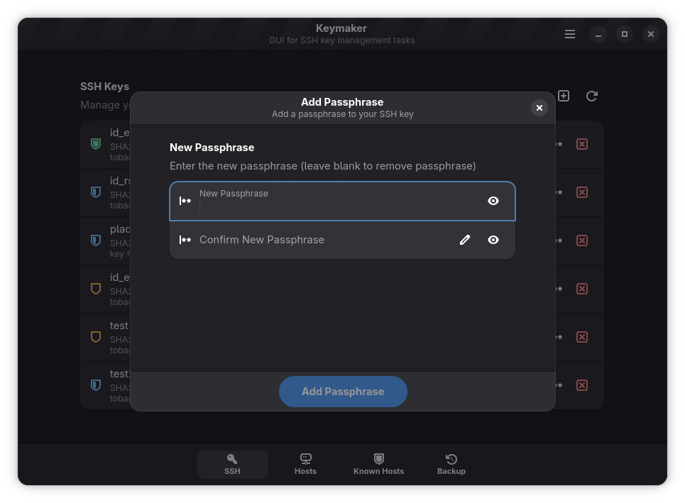
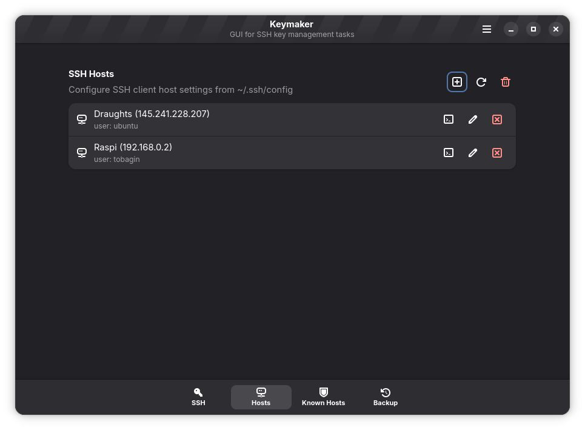
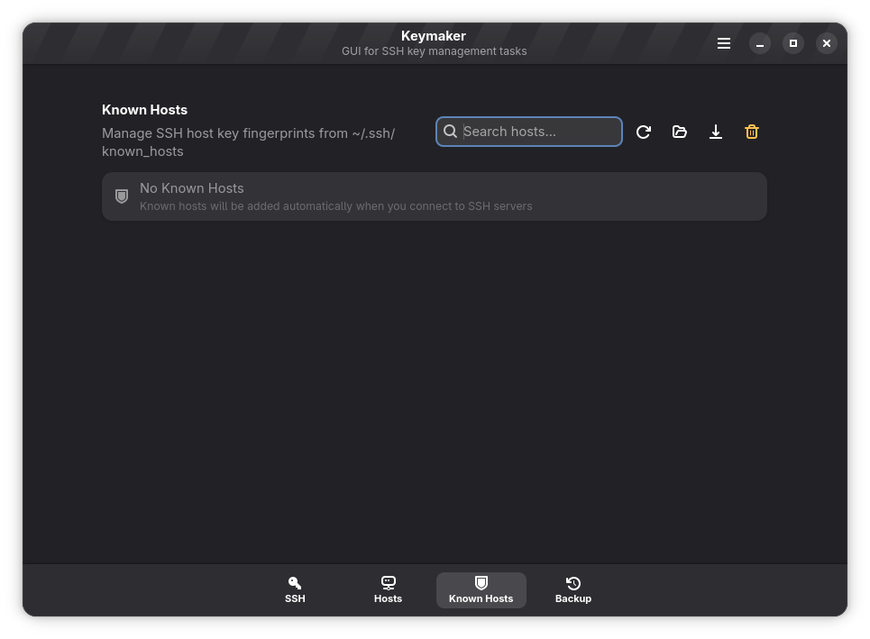
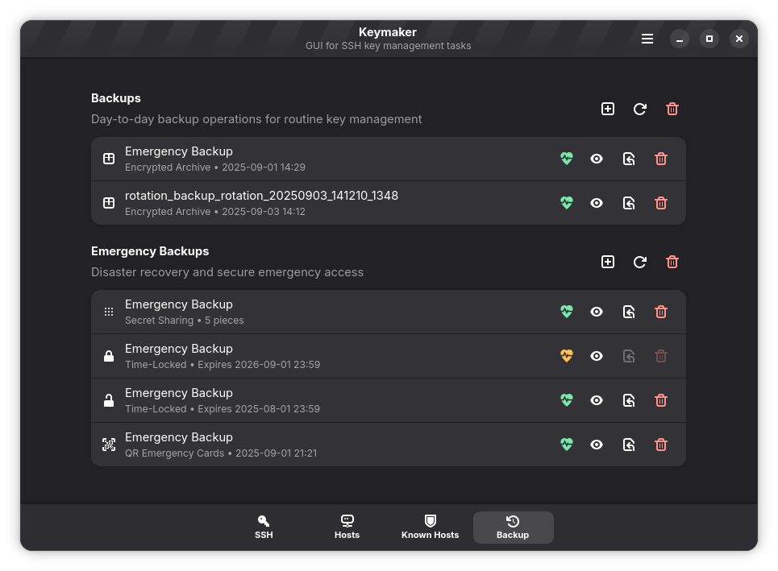
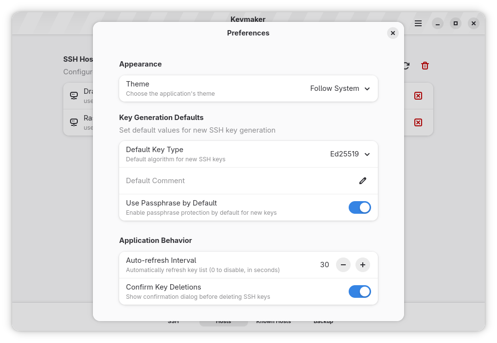
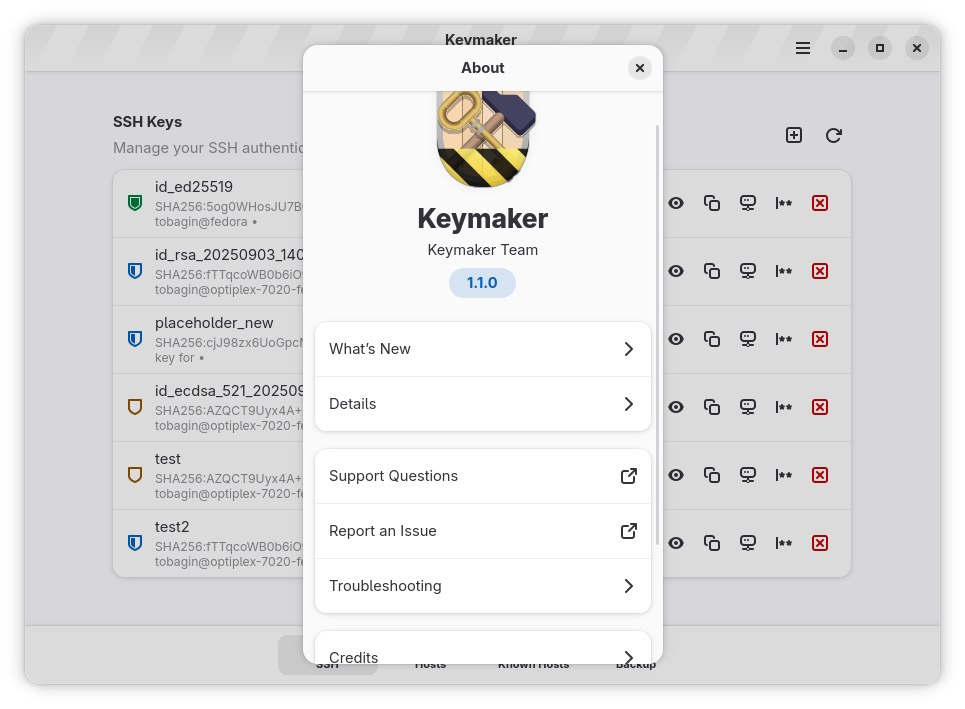

# Keymaker

Keymaker is a user-friendly, native GTK4/LibAdwaita application for managing SSH keys. It provides an intuitive interface for generating, managing, and deploying SSH keys without needing to use command-line tools.


## Features

### Core Features
- **Key Generation**: Easily generate Ed25519, RSA, and ECDSA keys.
- **Key Management**: View and manage existing keys in your `~/.ssh` directory.
- **Passphrase Management**: Securely change key passphrases.
- **Deployment**: Generate `ssh-copy-id` commands with a single click.
- **Clipboard Integration**: Quickly copy public keys to clipboard.
- **Safety**: Secure key deletion with confirmation.

### User Experience
- **Modern Interface**: Built with GTK4 and LibAdwaita for a native GNOME feel.
- **Responsive Design**: Adapts beautifully to different window sizes.
- **Dark Mode**: Fully supports system-wide dark mode preference.

## Installation

### Flatpak (Recommended)

[](https://flathub.org/apps/io.github.tobagin.keysmith)

### From Source

```bash
# Clone the repository
git clone https://github.com/tobagin/keymaker.git
cd keymaker

# Build and install development version
./scripts/build.sh --dev
```

## Usage

### Basic Usage

1.  **Generate a Key**: Click the "+" button, select your algorithm (Ed25519 recommended), and set a passphrase.
2.  **Copy Public Key**: Click the copy icon next to any key to copy the public key to your clipboard.
3.  **Deploy to Server**: Click the "server" icon to copy the `ssh-copy-id` command for that key.

### Preferences

Access preferences from the main menu to customize:
- Clean up old backups
- Confirmation dialogs settings

## Architecture

Keymaker is built using:
- **Language**: Vala
- **UI Toolkit**: GTK4 + LibAdwaita
- **Build System**: Meson

## Privacy & Security

- **Local Only**: All key operations are performed locally on your machine.
- **Secure Storage**: Passphrases can be stored in the system keyring (via LibSecret) if supported.
- **No Analytics**: No tracking or analytics data is collected.

## Contributing

Contributions are welcome! Please feel free to submit a Pull Request.

1.  Fork the project
2.  Create your feature branch (`git checkout -b feature/AmazingFeature`)
3.  Commit your changes (`git commit -m 'Add some AmazingFeature'`)
4.  Push to the branch (`git push origin feature/AmazingFeature`)
5.  Open a Pull Request

## License

Distributed under the GNU General Public License v3.0. See `LICENSE` for more information.

## Support

If you encounter any problems, please [open an issue](https://github.com/tobagin/keymaker/issues).

## Screenshots

| Main Window | Key Generation | Key Details |
|-------------|----------------|-------------|
|  |  |  |

| Deployment | Add Passphrase | Change Passphrase |
|------------|----------------|-------------------|
|  |  |  |

| Hosts | Known Hosts | Backup |
|-------|-------------|--------|
|  |  |  |

| Preferences | About |
|-------------|-------|
|  |  |

## Acknowledgments

- **Thiago Fernandes**: Developer and Designer
- **The GNOME Project**: For the amazing GTK toolkit
- **OpenSSH**: For the underlying SSH tools
