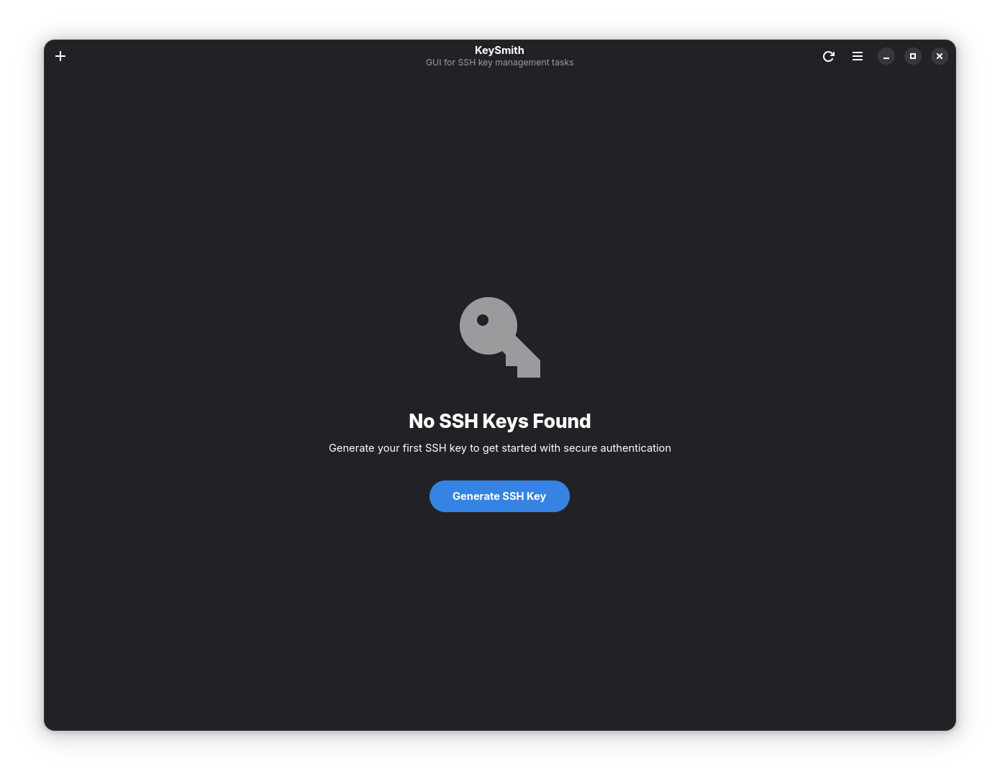
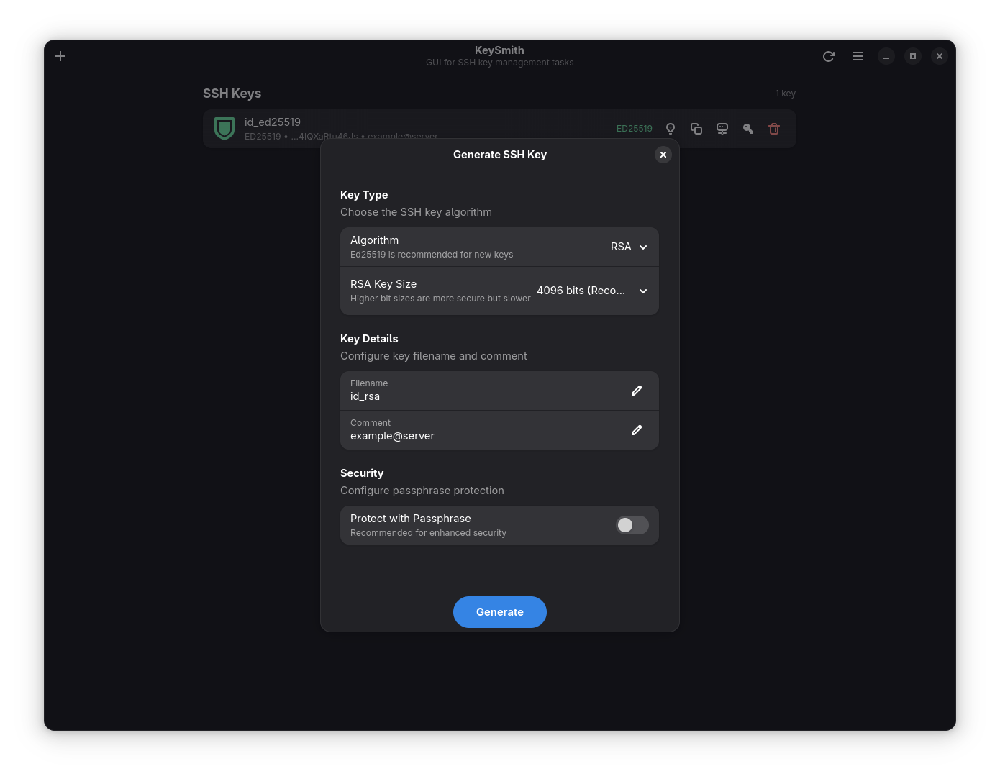
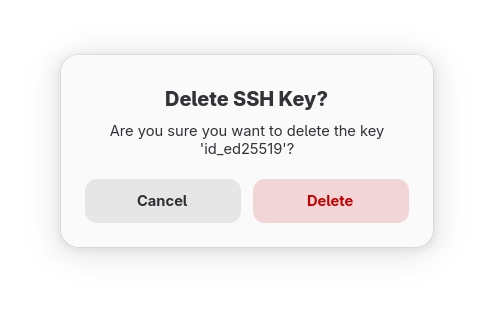

# KeySmith

[](https://www.gnu.org/licenses/gpl-3.0)
[](https://www.python.org/downloads/)
[](https://www.gtk.org/)

KeySmith is a modern GTK4/Libadwaita application that provides a user-friendly graphical interface for SSH key management tasks. It simplifies the process of generating, managing, and deploying SSH keys through an intuitive GUI while maintaining security best practices.

## Features

### 🔑 SSH Key Generation
- Generate Ed25519, RSA, and ECDSA SSH keys
- Customizable filename, comment, and passphrase options
- Configurable RSA bit sizes (2048, 3072, 4096, 8192)
- Secure key permissions (600) automatically applied

### 📋 Key Management
- Automatic scanning of `~/.ssh` directory
- Display key type, fingerprint, and metadata
- One-click public key copying to clipboard
- Generate ssh-copy-id commands for server deployment
- Secure key deletion with confirmation dialogs

### 🔒 Security & Passphrase Management
- Change key passphrases safely
- Never store or log passphrases
- Delegate all cryptographic operations to OpenSSH tools
- Secure file permission handling

### 🎨 Modern Interface
- GTK4 and Libadwaita design
- Follows GNOME Human Interface Guidelines
- Responsive and accessible interface
- System theme integration
- Toast notifications for user feedback

## Screenshots

### Main Interface

*Main window showing SSH key management with individual action buttons*


*Clean interface when no SSH keys are present*

### Key Generation

*Key generation dialog with comprehensive options*


*Real-time validation with helpful error feedback*

### Key Management

*Detailed SSH key information and fingerprint*


*Generate ssh-copy-id commands for server deployment*


*Secure passphrase management*


*Safe key deletion with confirmation*

### Settings

*Comprehensive preferences and settings*

## Installation

### From Source

#### Prerequisites

**System Dependencies:**
- Python 3.9+
- GTK4 development libraries
- Libadwaita 1.2+ development libraries
- Meson build system
- Ninja build tool
- GLib schema compiler

**Ubuntu/Debian:**
```bash
sudo apt install python3-dev libgtk-4-dev libadwaita-1-dev meson ninja-build \
  glib-compile-schemas desktop-file-utils
```

**Fedora:**
```bash
sudo dnf install python3-devel gtk4-devel libadwaita-devel meson ninja-build \
  glib2-devel desktop-file-utils
```

**Arch Linux:**
```bash
sudo pacman -S python gtk4 libadwaita meson ninja glib2 desktop-file-utils
```

#### Build Instructions

1. **Clone the repository:**
   ```bash
   git clone https://github.com/tobagin/keysmith.git
   cd keysmith
   ```

2. **Set up Python virtual environment:**
   ```bash
   python3 -m venv venv_linux
   source venv_linux/bin/activate
   pip install -r requirements.txt
   ```

3. **Configure and build:**
   ```bash
   meson setup builddir
   meson compile -C builddir
   ```

4. **Run from build directory:**
   ```bash
   # If schemas aren't found, specify the schema directory
   GSETTINGS_SCHEMA_DIR=./builddir/data ./builddir/keysmith
   ```

#### System Installation

To install KeySmith system-wide:

```bash
sudo meson install -C builddir
```

### Development Setup

For development, you can install in development mode:

```bash
# Install development dependencies
pip install -r requirements-dev.txt

# Install in development mode
pip install -e .

# Run directly
keysmith
```

## Usage

### Generating SSH Keys

1. Click the "Generate Key" button in the header bar
2. Select your preferred key type (Ed25519 recommended)
3. Set a filename and comment
4. Optionally add a passphrase for extra security
5. Click "Generate" to create the key pair

### Managing Existing Keys

- **View Keys**: All keys in `~/.ssh` are automatically listed
- **Copy Public Key**: Click the copy button to copy the public key to clipboard
- **Generate ssh-copy-id Command**: Use the network button to generate deployment commands
- **View Details**: Click the info button to see detailed key information
- **Delete Keys**: Use the menu to securely delete key pairs

### Application Preferences

KeySmith stores preferences using GSettings:
- Default key type (Ed25519/RSA)
- Default RSA bit size
- Auto-refresh settings
- UI preferences

## Configuration

### Environment Variables

KeySmith supports configuration through environment variables. Copy `.env.example` to `.env` and customize:

```bash
# Enable debug mode
KEYSMITH_DEBUG=true

# Set default key type
KEYSMITH_DEFAULT_KEY_TYPE=ed25519

# Set default RSA bit size
KEYSMITH_DEFAULT_RSA_BITS=4096

# Custom SSH directory
KEYSMITH_SSH_DIR=~/.ssh

# Enable verbose logging
KEYSMITH_VERBOSE=true
```

### GSettings Schema

KeySmith uses GSettings for persistent configuration:

```bash
# View all settings
gsettings list-recursively io.github.tobagin.keysmith

# Change default key type
gsettings set io.github.tobagin.keysmith default-key-type 'rsa'

# Set default RSA bit size
gsettings set io.github.tobagin.keysmith default-rsa-bits 4096
```

## Testing

KeySmith includes comprehensive unit tests:

```bash
# Run all tests
python -m pytest tests/ -v

# Run with coverage
python -m pytest tests/ --cov=keysmith --cov-report=html

# Run specific test file
python -m pytest tests/test_models.py -v

# Run linting
ruff check keysmith/ tests/
black --check keysmith/ tests/
mypy keysmith/
```

## Security

KeySmith follows security best practices:

- **Never stores passphrases** - held in memory only during operations
- **Delegates cryptography** to system OpenSSH tools
- **Secure file permissions** - private keys use 600 permissions
- **Input validation** - all user inputs are validated using Pydantic
- **No shell injection** - subprocess calls never use `shell=True`

## Flatpak Packaging

KeySmith is designed for Flatpak distribution:

```bash
# Build Flatpak (requires flatpak-builder)
flatpak-builder --user --install --force-clean build-dir io.github.tobagin.keysmith.yml

# Run Flatpak version
flatpak run io.github.tobagin.keysmith
```

## Architecture

KeySmith is organized into focused modules:

```
keysmith/
├── __init__.py          # Package initialization
├── main.py              # Application entry point
├── models/              # Pydantic data models
│   ├── __init__.py
│   └── ssh_key.py
├── backend/             # SSH operations and file scanning
│   ├── __init__.py
│   ├── ssh_operations.py
│   └── key_scanner.py
└── ui/                  # GTK4/Libadwaita interface
    ├── __init__.py
    ├── window.py        # Main application window
    ├── key_list.py      # Key list widget
    ├── key_row.py       # Individual key row
    └── generate_dialog.py # Key generation dialog
```

## Future Development

### Phase 2: Workflow Integration
- **SSH Config Management**: Edit `~/.ssh/config` files
- **SSH Agent Integration**: Manage loaded keys
- **Interactive ssh-copy-id**: Execute deployments directly

### Phase 3: Advanced Features
- **known_hosts Management**: Safe host key management
- **Cloud Integration**: Direct GitHub/GitLab key deployment
- **Security Auditing**: Key health and security recommendations

## Contributing

Contributions are welcome! Please see our [Contributing Guide](CONTRIBUTING.md) for details.

### Development Workflow

1. Fork the repository
2. Create a feature branch
3. Make your changes with tests
4. Run the test suite
5. Submit a pull request

### Code Style

- Follow PEP 8 style guidelines
- Use type hints throughout
- Add docstrings for all public functions
- Include unit tests for new features
- Format code with `black`
- Lint with `ruff`

## Support

- **Bug Reports**: [GitHub Issues](https://github.com/tobagin/keysmith/issues)
- **Feature Requests**: [GitHub Discussions](https://github.com/tobagin/keysmith/discussions)
- **Documentation**: [Project Wiki](https://github.com/tobagin/keysmith/wiki)

## License

KeySmith is licensed under the GNU General Public License v3.0 or later. See the [LICENSE](LICENSE) file for details.

## Acknowledgments

- Built with [GTK4](https://www.gtk.org/) and [Libadwaita](https://gnome.pages.gitlab.gnome.org/libadwaita/)
- Uses [PyGObject](https://pygobject.gnome.org/) for Python bindings
- Follows [GNOME Human Interface Guidelines](https://developer.gnome.org/hig/)
- Inspired by the need for accessible SSH key management tools
